## _Outline_

::: {.incremental}
* **Apa sebenarnya akal imitasi?** — dari model statistik ke *agentic* dan *embodied AI*
* **Bagaimana *user* menggunakan AI?** — bagaimana bukti dari riset empiris?
* **Pengantar *AI Fluency Framework*** — mengapa *fluency* menentukan kualitas *output*
  + ***Delegation*** — menentukan tugas apa yang dapat dilakukan AI
  + ***Description*** — berkomunikasi dengan AI
  + ***Discernment*** — mengevaluasi *output* AI secara kritis
  + ***Diligence*** — menggunakan AI secara bertanggung jawab 
* **Kesimpulan** dan *take-away message* dari saya
:::

## Perlu diketahui

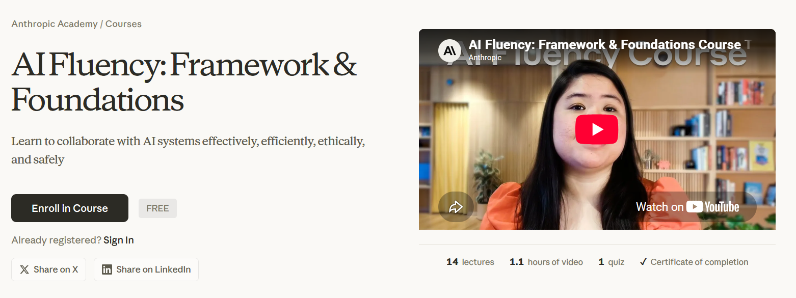{fig-align="center" width="90%"}

::: aside
**Bagaimana saya menyusun materi ini dan *disclosure* penggunaan AI**

Materi ini banyak terinspirasi dari kursus daring "*AI Fluency: Framework & Foundations*" yang disediakan secara gratis oleh Anthropic.

[**Klik di sini untuk mengikuti kursus tersebut**](https://anthropic.skilljar.com/ai-fluency-framework-foundations)

Saya menggunakan Claude Code (Model Opus 5 dan Sonnet 5) untuk *brainstorming* materi, mencari referensi, dan melakukan *troubleshooting* kode `quarto` dan `git`. Saya bertanggung jawab penuh atas substansi dan penyajian presentasi ini.

:::

## Mungkin kursus ini juga menarik?

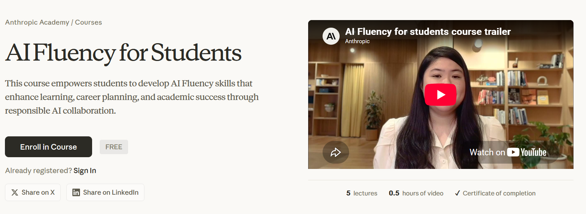

::: aside
*AI Fluency for Students*

[**Klik di sini untuk mengikuti kursus tersebut**](https://anthropic.skilljar.com/ai-fluency-for-students)

:::

## Sebelum mulai... 🙋‍♀️

Angkat tangan kalau dalam **seminggu terakhir** Anda:

::: {.incremental}
1. Menggunakan AI *chatbot* (e.g., ChatGPT, Claude, Gemini, Copilot, Kimi, DeepSeek, dll.) minimal sekali
2. Menggunakannya untuk tugas-tugas yang berkaitan dengan perkuliahan atau pekerjaan
3. Menggunakannya untuk urusan **di luar** kuliah dan pekerjaan (e.g., minta resep masakan, curhat, menyusun rencana liburan, dsb.)
4. Pernah **mendapati** AI memberikan **jawaban yang salah**, tapi *tone output* teksnya sangat meyakinkan
:::

::: {.callout-note}
### Ingat-ingat jawaban Anda tadi
...nanti kita cocokkan dengan data penggunaan AI secara global.
:::

::: notes
Pembuka interaktif ±5 menit. Poin 4 adalah jembatan penting ke materi discernment — tanyakan ke 1-2 mahasiswa: "kapan terakhir kali AI mengarang? Bagaimana Anda tahu jawabannya salah?"
:::

# Apa Sebenarnya Akal Imitasi? 🤖 {background-color="#14497F"}

## *Artificial intelligence* a.k.a "akal imitasi"

::: {.incremental}
* Banyak orang menerjemahkan *artificial intelligence* sebagai "kecerdasan buatan" dalam Bahasa Indonesia, dan akibatnya, publik menganggap **seolah-olah** AI benar-benar *cerdas*
* Padahal AI *chatbot* adalah model statistik dengan *output* teks ("*large language model*") yang **meniru** proses dan produk kognisi manusia ("bahasa natural")
* Frasa *akal imitasi* mengingatkan kita pada dua hal sekaligus:
  + Kemampuan *large language model* (LLM) **terasa natural** seperti manusia karena kualitas teks *output*nya memang sangat meyakinkan
  + Tapi ia **bukan manusia**, sehingga tidak punya pemahaman, niat, apalagi tanggung jawab
* Konsekuensinya: yang bertanggung jawab atas *output* teks AI adalah **kita** sebagai penggunanya
:::

## AI tidak *ujug-ujug* diciptakan

::: {.columns}
::: {.column width="60%"}

::: {.incremental}
* **1950-an–1980-an** — AI simbolik: manusia menuliskan aturan logikanya satu per satu (*expert systems*)
* **1990-an–2000-an** — *machine learning*: mesin belajar pola dari data, bukan lagi dari aturan eksplisit (e.g., *spam filter*)
* **2010-an** — *deep learning* yang merupakan permodelan bahasa yang meniru cara kerja jaringan saraf manusia; terobosan besar dalam rekognisi gambar dan suara (*natural language processing*, NLP)
* **2017** — arsitektur [***transformer***](https://www.ibm.com/think/topics/transformer-model) diperkenalkan, yang merupakan fondasi semua LLM modern
* **2022** — OpenAI merilis GPT-3.5; *generative* AI menjadi fenomena massal
:::
:::

::: {.column width="40%"}
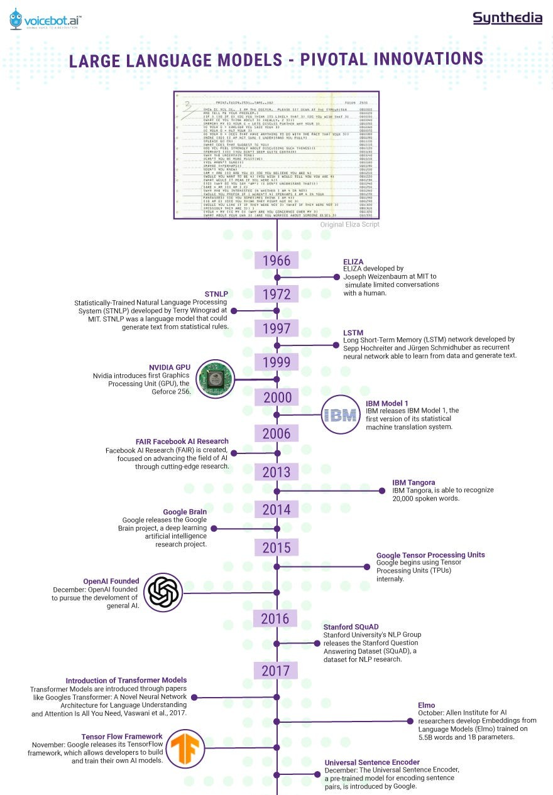{fig-align="center" width="90%"}

::: {style="text-align: center"}
[Klik di sini untuk lengkapnya](libs/sejarah.jpg)
:::

:::
:::

::: aside
Sumber: [*A Timeline of LLM Innovation*](https://synthedia.substack.com/p/a-timeline-of-large-language-model)
:::

## Model Statistik di Balik Layar

*Large language model* (LLM) pada intinya adalah model statistik raksasa dengan *output* teks yang menjawab satu pertanyaan:

> **"Dari semua *input* kata sejauh konteks percakapan ini, kata apa yang paling mungkin muncul berikutnya?"**

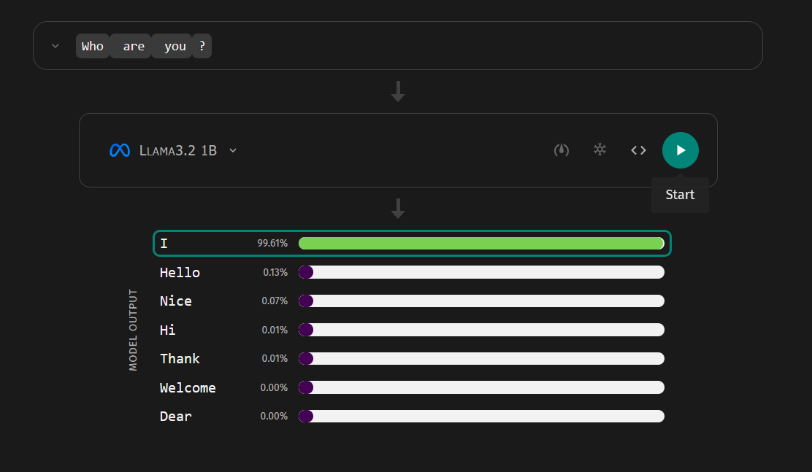{fig-align="center" width="80%"}

### Klik di sini ➡️ [AnimatedLLM](https://animatedllm.github.io/generation-simple)

## *Transformer* dan [mekanisme *attention*](https://proceedings.neurips.cc/paper_files/paper/2017/file/3f5ee243547dee91fbd053c1c4a845aa-Paper.pdf)

::: {.columns}
::: {.column width="60%"}

Terobosannya adalah mekanisme ***attention***: setiap kata bisa "memperhatikan" konteks dari semua kata lain dalam konteks untuk menentukan maknanya.

::: {.incremental}
* "Bisa **ular** itu amat mematikan" vs. "Saya **bisa** datang besok"
  + "Bisa" adalah kata yang sama, makna berbeda (i.e., "homonim")
* Model bahasa generasi sebelumnya membaca kata satu per satu secara berurutan; *transformer* memproses seluruh kalimat **sekaligus, secara paralel**
* Paralelisme inilah yang memungkinkan *training* dengan data yang jauh lebih besar (e.g., [Kimi 3 dengan 2.8 trilyun parameter](https://www.kimi.com/blog/kimi-k3))
:::
:::

::: {.column width="40%"}
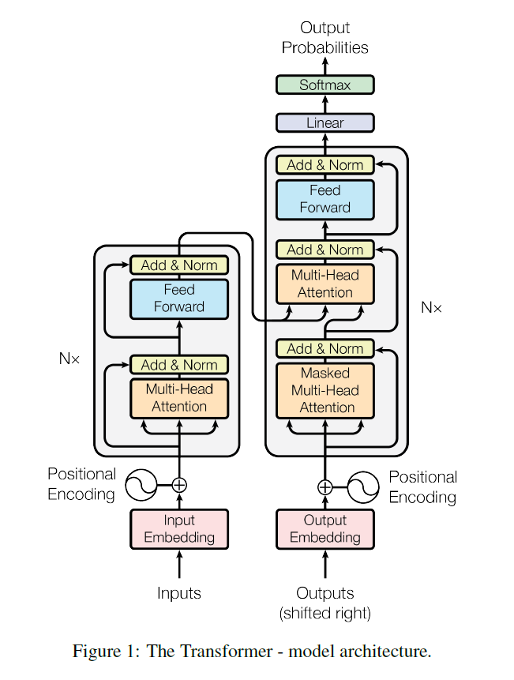{fig-align="center"}
:::
:::

::: aside
[*Attention is all you need* (Vaswani et al., 2017)](https://proceedings.neurips.cc/paper_files/paper/2017/file/3f5ee243547dee91fbd053c1c4a845aa-Paper.pdf)
:::

## Bagaimana LLM "dibesarkan"?

2️⃣ tahap utama:

::: {.incremental}
1. ***Pre-training*** — model membaca miliaran dokumen dan belajar memprediksi kata berikutnya
   + Hasilnya: *base model* yang menguasai pola bahasa, pengetahuan umum, bahkan penalaran, tapi belum bisa menjadi "asisten" 
2. ***Fine-tuning*** (termasuk [*reinforcement learning from human feedback*, RLHF](https://en.wikipedia.org/wiki/Reinforcement_learning_from_human_feedback)) — model dilatih mengikuti instruksi, menjawab dengan sopan, dan menolak permintaan tidak patut bahkan berbahaya
   + Hasilnya: *Chatbot* seperti ChatGPT, DeepSeek, atau Claude yang Anda kenal sekarang
:::

::: {.callout-tip}
### Analogi proses psikologisnya 

*Pre-training* ≈ pemerolehan bahasa dan pengetahuan; *fine-tuning* ≈ sosialisasi — belajar norma tentang *bagaimana* menggunakan kemampuan itu.
:::

## Optimasi LLM

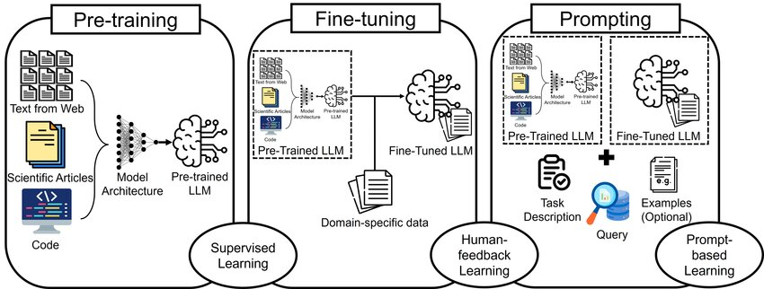{fig-align="center"}

::: {style="text-align: center"}
Sumber: [Ghali, et al. (2024)](https://www.researchgate.net/publication/381108819_GAMedX_Generative_AI-based_Medical_Entity_Data_Extractor_Using_Large_Language_Models)
:::

## Kemampuan AI meningkat drastis karena... 

::: {.columns}
::: {.column width="50%"}

::: {.incremental}
1. **Arsitektur** — model *transformer* (2017) yang bisa diskalakan
2. **Data** — teks digital dalam volume luar biasa besar di internet (sekian trilyun parameter)
3. ***Hardware*/Komputasi** — GPU dan investasi besar-besaran pada AI *data center*
:::

::: {.callout-tip}
### *Emergent capabilities*

Gabungan ketiganya memunculkan fenomena menarik, yaitu *emergent capabilities* kemampuan yang muncul begitu saja setelah model melewati ukuran tertentu, tanpa pernah diprogram secara eksplisit (menerjemahkan, menulis kode, penalaran berantai...)
:::

:::
::: {.column width="50%"}

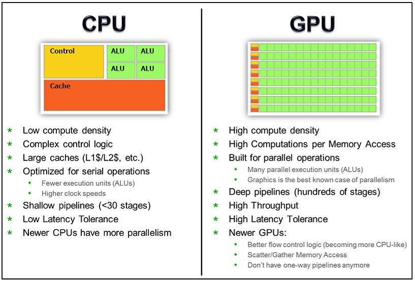{fig-align="center"}

::: {style="text-align: center"}
[Sumber gambar](https://www.linkedin.com/posts/mimransarwar_techinsights-ai-gpu-share-7276270511972630528-Vioh/)
:::

:::
:::

## Dari *chatbot* ke *agentic* dan *embodied AI*

::: {.columns}
::: {.column width="50%"}

Lanskapnya berubah sangat cepat:

::: {.incremental}
* ***Chatbot*** — merespons pesan Anda satu per satu (ChatGPT-3.5, 2022)
* ***Reasoning models*** — "berpikir" langkah demi langkah dulu sebelum menjawab (e.g., model-model "*frontier*" seperti Opus 5, Kimi 3, GPT-5.6 Sol, Fable 5, etc.)
* ***AI agent*** — merencanakan dan mengeksekusi tugas multi-langkah **secara mandiri** atas nama penggunanya, misalnya menjelajah web, memakai aplikasi, menulis dan menjalankan kode pemrograman [Yang et al. (2025)](https://arxiv.org/abs/2512.07828)
* ***Embodied AI*** — akal imitasi yang diberi "tubuh": robot yang "ditanam" LLM
:::
:::

::: {.column}

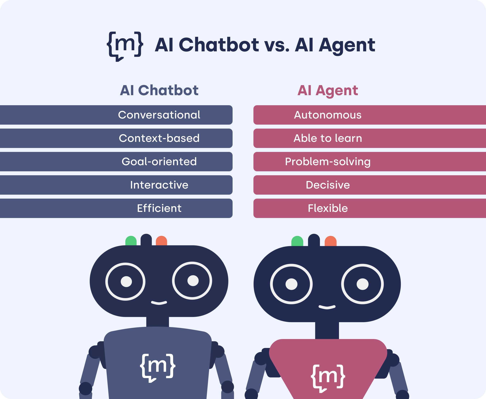{fig-align="center" width="80%"}

::: {style="text-align: center"}
[Sumber gambar](https://www.moin.ai/en/chatbot-wiki/ai-agent)
:::

:::
:::

## *Embodied* AI

{fig-align="center" width="80%"}

::: {style="text-align: center"}
[Sumber: Fung, et al. (2025)](http://arxiv.org/abs/2506.22355)
:::

## Apa *keterbatasan* AI?

::: {.incremental}
* **Halusinasi** — menghasilkan *output* yang salah secara faktual, tetapi dengan *tone* yang sangat meyakinkan, termasuk **mengarang referensi ilmiah** 
* ***Knowledge cutoff*** — pengetahuannya berhenti di tanggal tertentu; kejadian terbaru tidak diketahuinya, kecuali dilengkapi fitur pencarian web
* ***Context window*** terbatas — *working memory*-nya bisa penuh; percakapan dan dokumen yang sangat panjang terpaksa terpotong, tidak selesai diproses
* **Penalaran yang rapuh** — LLM bisa memberikan jawaban yang sama sekali berbeda ketika *prompt*nya diubah sedikit saja dari pola *data training*nya
* ***Sycophancy*** — cenderung memberikan jawaban yang menyenangkan *user*, alih-alih mengoreksi kesalahan yang dilakukan oleh *user*
:::

# Untuk Apa AI Digunakan? 📊 {background-color="#14497F"}

## Adopsi teknologi tercepat dalam sejarah

[Chatterji et al. (2025)](https://cdn.openai.com/pdf/a253471f-8260-40c6-a2cc-aa93fe9f142e/economic-research-chatgpt-usage-paper.pdf), penggunaan ChatGPT dalam skala besar:

::: {.incremental}
* Juli 2025: **±700 juta pengguna mingguan** ≈ **10% populasi dewasa dunia**, dengan **18 miliar pesan per minggu**
* Kesenjangan gender pengguna awal (didominasi laki-laki) **menyempit drastis**
* Pertumbuhan justru **lebih tinggi di negara berpendapatan rendah**
:::

::: {.callout-important}
### Kemampuan berkolaborasi dengan AI menjadi keterampilan esensial

Konsekuensinya, kemampuan berkolaborasi dengan AI akan menjadi keterampilan dasar, seperti halnya literasi digital.
:::

## Untuk apa orang menggunakannya?

Temuan dari [Chatterji et al. (2025)](https://cdn.openai.com/pdf/a253471f-8260-40c6-a2cc-aa93fe9f142e/economic-research-chatgpt-usage-paper.pdf):

::: {.incremental}
* Penggunaan **non-pekerjaan** tumbuh lebih cepat daripada penggunaan AI untuk pekerjaan: dari 53% (2024) menjadi **>70%** (2025) dari seluruh pesan
* Hampir **80%** percakapan masuk ke tiga kategori besar:
  + ***Practical guidance*** — *tutoring*, saran *how-to*, *brainstorming* ide (kategori terbesar)
  + ***Seeking information*** — menggantikan mesin pencari
  + ***Writing*** — menulis **dan** menyunting; 40% dari pesan terkait pekerjaan
* Menariknya: ⅔ pesan pada tugas *writing* meminta AI **mengolah teks penggunanya** (menyunting, mengkritik, menerjemahkan), bukan benar-benar menulis dari nol
* *Value* utamanya adalah ***decision support*** 
  + AI sebagai teman berpikir untuk pekerjaan yang berkaitan dengan produksi pengetahuan
:::

## Tren terbaru: penggunaan *AI agent*

[Yang et al. (2025)](https://arxiv.org/abs/2512.07828) melakukan *field study* pertama tentang *AI agent* (Comet Assistant, Perplexity):

::: {.incremental}
* Dua topik terbesar: ***productivity & workflow*** dan ***learning & research*** — **57%** dari seluruh *query*
* Konteks penggunaan: **55% personal**, 30% profesional, 16% pendidikan
* *Early adopters*-nya: pekerja sektor digital dan padat pengetahuan, termasuk **akademisi**
* Seiring waktu, pengguna bergeser ke tugas-tugas yang **membutuhkan kapasitas kognitif yang lebih besar**
:::

## Belajar sekarang, sebelum terlambat

**Pesan saya untuk Anda** sebagai mahasiswa magister psikologi:

::: {.incremental}

* AI sudah menjadi bagian dari infrastruktur aktivitas akademik. Fokusnya saat ini adalah belajar *bagaimana* caranya menggunakan AI
* Oleh karena itu, menggunakan AI dengan **efektif, efisien, etis, dan aman** harus dipelajari dan diusahakan dengan sungguh-sungguh
* Keterampilan berkolaborasi dengan AI harus dipelajari mulai sekarang, **sebelum menggunakan AI semakin kompleks dan mahal**

:::

## AI digunakan dalam riset psikologi

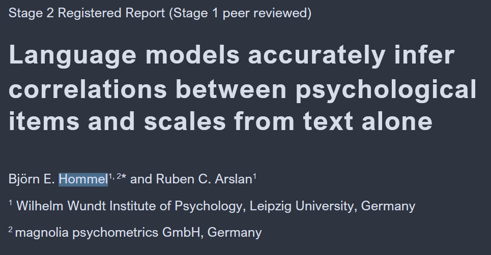{fig-align="center" width="80%"}

::: {style="text-align: center"}
[Hommel & Arslan (2025)](https://osf.io/preprints/psyarxiv/kjuce_v4/)
:::

## AI digunakan dalam riset psikologi

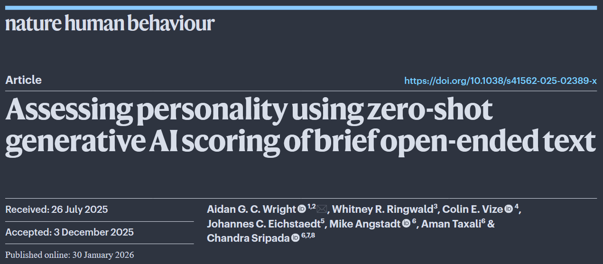{fig-align="center" width="80%"}

::: {style="text-align: center"}
[Wright, et al. (2026)](https://www.nature.com/articles/s41562-025-02389-x)
:::

## AI digunakan dalam riset psikologi

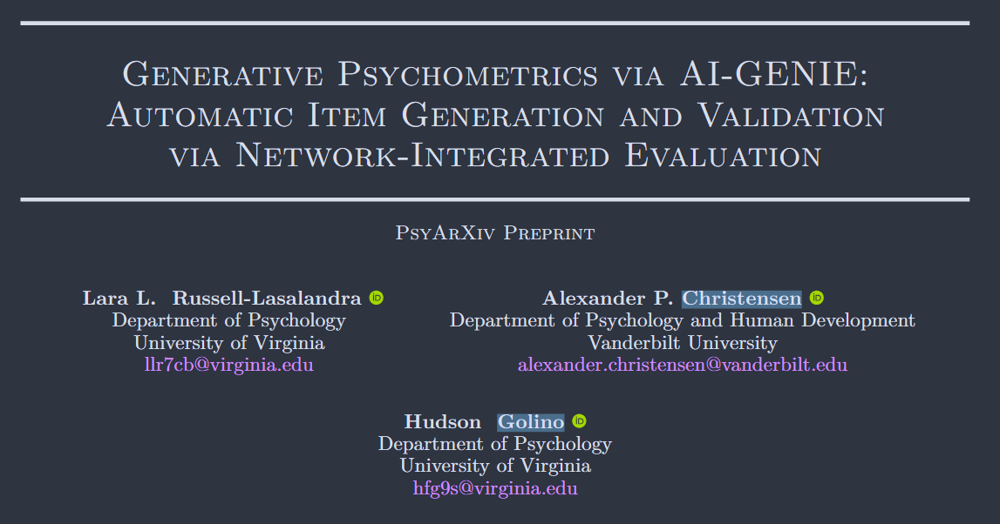{fig-align="center" width="80%"}

::: {style="text-align: center"}
[Russell-Lasalandra, et al. (2024)](https://osf.io/fgbj4_v1)
:::

# Pengantar AI Fluency Framework 🧭 {background-color="#14497F"}

## *AI literacy* vs. *AI fluency*

[Rogers & Carbonaro (2025)](https://jtl.uwindsor.ca/index.php/jtl/article/view/9420) membedakan dua jenjang kompetensi:

::: {.columns}
::: {.column width="50%"}
***AI literacy***

* **Memahami** cara kerja AI
* **Mengevaluasi** teknologi AI
* Tahu risiko dan batasannya
:::
::: {.column width="50%"}
***AI fluency***

* **Berkarya dan berinovasi** dengan AI
* Memecahkan masalah bersama AI
* Mengelola penggunaannya secara etis
:::
:::

::: {.fragment}
Analoginya seperti belajar bahasa: *literacy* = bisa membaca; *fluency* = bisa berbincang dengan lancar. 

Bagian awal presentasi tadi fokusnya adalah *literacy*; sisa sesi ini berikutnya akan membahas tentang *fluency*.
:::

::: {.callout-note}
### Definisi *AI fluency*

Kemampuan berkolaborasi dengan AI secara **efektif, efisien, etis, dan aman** ([Bent, Dakan, Feller, & Vo, 2026](https://anthropic.skilljar.com/ai-fluency-framework-foundations)).
:::

## Mengapa *fluency* menentukan hasil?

[Potts & Sudhof (2026)](http://arxiv.org/abs/2604.25905) menganalisis 27 ribu transkrip percakapan manusia–AI:

::: {.incremental}
* Pengguna yang fasih mengerjakan tugas yang **jauh lebih kompleks** (rata-rata 3,1 vs. 1,5 pada skala 5)
* Pengguna fasih bersikap ***augmentative*** dalam kolaborasi — berulang-ulang menyempurnakan, mempertajam tujuan, dan mengkritisi *output*
* Sebaliknya, pengguna pemula bersikap **pasif** — menerima begitu saja rencana dan jawaban AI
:::

::: {.fragment}
**Paradoksnya:** pengguna fasih justru mengalami **lebih banyak kegagalan** (i.e., menolak *output* AI), tapi kegagalan mereka *visible*, karena mereka aktif memeriksa, dan lebih sering berujung pada perbaikan *output*. 

**Kegagalan pemula justru *invisible***. Artinya, percakapan tampak sukses men*deliver* *output*, padahal hasilnya meleset dan tidak koheren sama sekali.
:::

::: {.callout-important}
## Kesimpulannya
*Fluency* menentukan apakah AI di tangan Anda menjadi produsen AI *slop* atau asisten yang bisa diandalkan (*tool*).
:::

## 3️⃣ mode kolaborasi dengan AI

[Bent, Dakan, Feller, & Vo, 2026](https://anthropic.skilljar.com/ai-fluency-framework-foundations) mengidentifikasi tiga cara kita melibatkan AI:

::: {.incremental}
* ***Automation*** — AI mengerjakan tugas spesifik sesuai instruksi Anda
  + *"Terjemahkan abstrak ini ke bahasa Indonesia"*
* ***Augmentation*** — Anda dan AI berkolaborasi sebagai mitra berpikir
  + *"Ayo kita bedah kelemahan desain penelitian saya satu per satu"*
* ***Agency*** — Anda mengonfigurasi AI untuk bekerja mandiri atas nama Anda
  + *"Setiap ada artikel baru tentang topik X, ringkas isinya dan kirimkan ringkasannya ke email saya setiap pagi"*
:::

::: {.fragment}
Riset menunjukkan mode yang paling produktif untuk pekerja pengetahuan adalah ***augmentation***, yaitu AI sebagai *thought partner*, bukan pengganti proses berpikir ([Potts & Sudhof, 2026](http://arxiv.org/abs/2604.25905)).
:::

## *Automation* vs. *Agency*

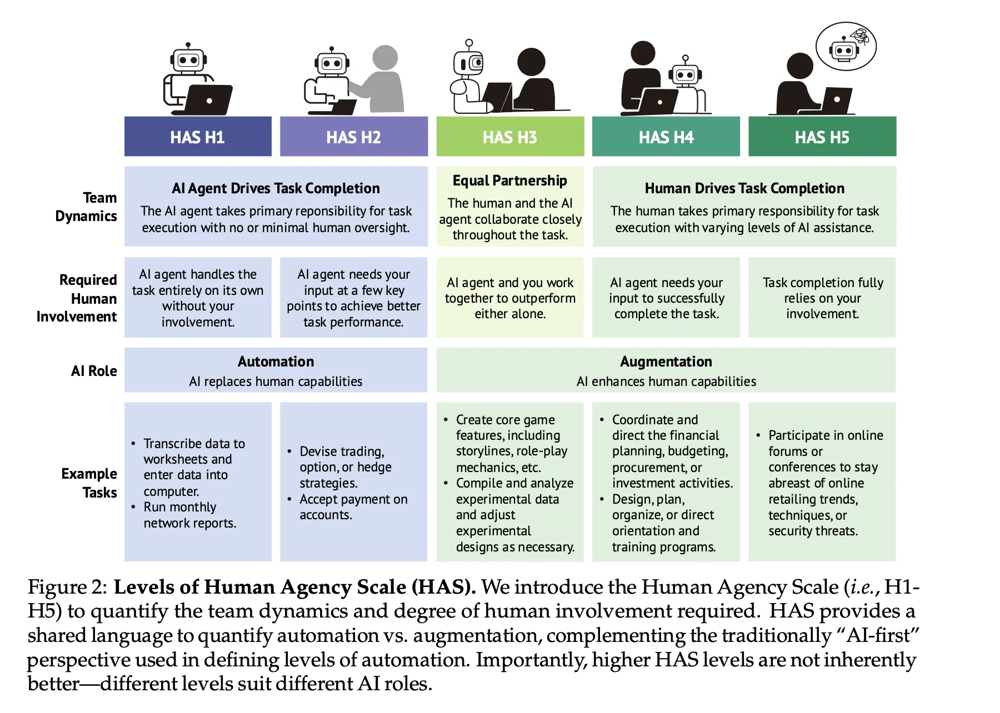{fig-align="center" width="80%"}

::: {style="text-align: center"}
[Sumber: Shao, et al. (2025)](https://arxiv.org/abs/2506.06576)
:::

## 4️⃣D AI *Fluency Framework*

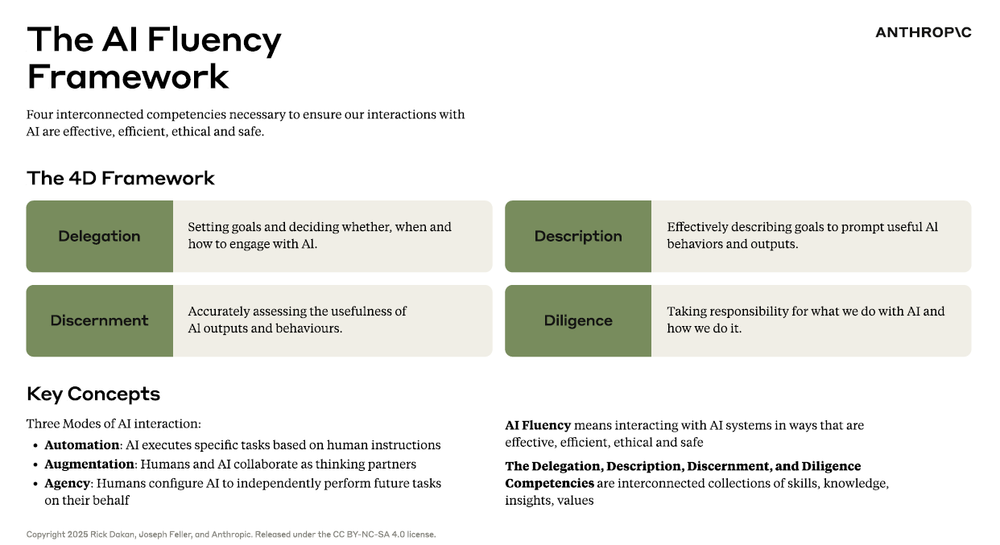{fig-align="center" width="90%"}


::: {.callout-note}
### *Catatan*

*Delegation* dan *description* → **efektif dan efisien**; *discernment* dan *diligence* → **etis dan aman**. Hari ini kita mendalami tiga yang terakhir.
Materi 4D diadaptasi dari kursus *AI Fluency: Framework & Foundations*, [Bent, Dakan, Feller, & Vo, 2026](https://anthropic.skilljar.com/ai-fluency-framework-foundations).
:::

## *Delegation* secara singkat

Sebelum meminta *chatbot* melakukan sesuatu, tanyakan 3️⃣ hal ini pada diri Anda sendiri:

::: {.incremental}
1. ***Problem awareness*** — apa sebenarnya tujuan saya berkolaborasi dengan AI? Seperti apa *output* teks yang baik dan bisa saya terima?
2. ***Platform awareness*** — AI (yang mana) bisa apa, dan apa yang ia tidak bisa lakukan?
3. ***Task delegation*** — bagian mana yang butuh keahlian dan *judgment* **saya**; bagian mana yang bisa dikerjakan AI; bagian mana yang paling berdampak kalau dikerjakan **bersama**?
:::

::: {.fragment}
Contoh untuk tesis Anda:

| Tugas | Delegasi |
|---|---|
| Merumuskan pertanyaan penelitian | **Anda** (AI boleh menjadi mitra diskusi) |
| Memoles bahasa akademik naskah | **AI**, lalu Anda sunting |
| Menginterpretasi hasil analisis | **AI dan Anda bersama-sama**, AI menawarkan alternatif, Anda yang membuat keputusan akhir |
:::

# Description: Berkomunikasi dengan Jernih 🗣️ {background-color="#14497F"}

## AI tidak bisa membaca pikiran Anda

::: {.columns}
::: {.column width="60%"}

Kualitas *output* AI sangat ditentukan oleh kualitas komunikasi Anda. Berikut ini adalah 3️⃣ komponen *description*:

::: {.incremental}
* ***Product description*** — **apa** yang Anda inginkan: bentuk *output*, format, audiens, gaya, dst.
* ***Process description*** — **bagaimana** sebaiknya AI mengerjakannya: metode, kerangka, urutan langkah
* ***Performance description*** — **bagaimana AI harus "bersikap"** selama kolaborasi: ringkas atau rinci? Menantang atau suportif? Bertanya dulu atau langsung eksekusi?
:::

:::
::: {.column width="40%"}

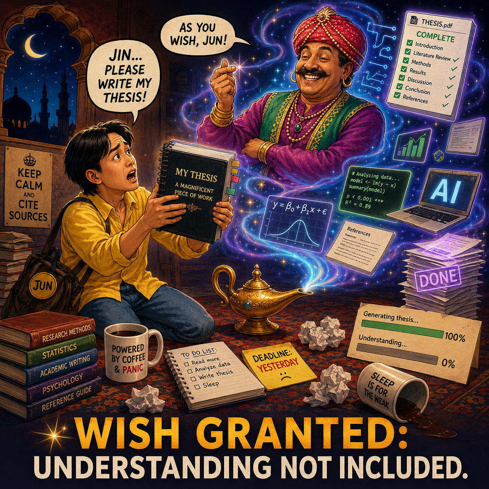{fig-align="center" width="90%"}

::: {style="text-align: center; font-size: 0.5em;"}
Ilustrasi dibuat dengan GPT-5.5
:::

:::
:::

::: {.callout-caution}
### Perlakukan AI sebagai kolaborator, bukan "jin botol"🧞

Komunikasikan dan evaluasi *output* AI, meskipun Anda menolak *output* dari percakapan tersebut. Jelaskan mengapa *output* tersebut Anda tolak sehingga AI bisa menyesuaikan *output* berikutnya berdasarkan *feedback* Anda, sesuai prinsip [*reinforcement learning from human feedback* (RLHF)](https://www.ibm.com/think/topics/rlhf).
:::

## 6️⃣ teknik *prompt engineering*

::: {.incremental}
1. **Berikan konteks** — apa yang Anda inginkan, untuk apa, dan latar belakang yang relevan
2. **Tunjukkan contoh** — perlihatkan gaya atau format *output* yang Anda harapkan dari AI
3. **Tetapkan batasan** — format, panjang, cakupan, dan apa yang *tidak* boleh
4. **Pecah tugas kompleks menjadi langkah-langkah kecil** — pandu penalaran AI dalam mengerjakan tugas secara bertahap
5. **Minta AI berpikir dulu** (*planning mode*) — beri ruang untuk menalar sebelum menjawab lalu beri *feedback* agar *output* semakin presisi
6. **Tentukan peran atau gaya bicaranya** (*persona*) — misalnya sebagai dosen pembimbing yang teliti dan kritis, atau tutor yang sabar
:::

::: {.fragment}
🗝️ **Tips:** Anda bisa minta AI memperbaiki *prompt* Anda. 

Contoh: *"Sebelum menjawab, tolong sarankan dulu bagaimana permintaan dan instruksi ini bisa saya tulis dengan lebih jelas."*
:::

## Contoh *prompt engineering* yang efektif

***Automation*** 😞

```
Buatkan tiga halaman tinjauan pustaka tentang depresi untuk tesis saya.
```

***Augmentation*** 😊

```
Kamu adalah asisten riset yang kritis dan teliti. Saya mahasiswa S2 psikologi yang sedang menyusun proposal tesis tentang depresi pada mahasiswa magister.

Bantu saya menyusun kerangka tinjauan pustaka (bukan isi lengkapnya):
1. Identifikasi 4-6 tema besar yang lazim dibahas dalam literatur
   depresi (misalnya: pengukuran, prediktor, intervensi).
2. Untuk tiap tema, tuliskan 2-3 pertanyaan yang perlu dijawab
   tinjauan pustaka saya.
3. Sarankan istilah pencarian (bahasa Inggris) untuk tiap tema.

Perhatikan batasan ini: jangan mengarang referensi yang tidak pernah ada. Kalau tidak yakin, terbuka saja bilang tidak yakin. Kalau konteks dari saya masih kurang detil,
berikan pertanyaan sebelum mulai tugasnya. Jangan selalu setuju pada argumen saya, Anda harus melakukan "Devil's advocate" ketika berinteraksi dengan saya.
```

::: notes
Minta mahasiswa mengidentifikasi teknik mana saja yang terpakai: konteks ✓, batasan ✓, langkah ✓, peran ✓, dan performance description ("bertanyalah dulu").
:::

# Discernment: Mengevaluasi Secara Kritis 🔍 {background-color="#14497F"}

## Sisi lain dari percakapan

*Discernment* adalah cara Anda **menilai** *output* yang diberikan AI. Komponennya:

::: {.incremental}
* ***Product discernment*** — menilai ***output***-nya: akurat? Runtut? Sesuai kebutuhan dan audiens?
* ***Process discernment*** — menilai bagaimana **cara AI membuat *output***: ada lompatan logika? Ada yang terlewat? Penalarannya keliru?
* ***Performance discernment*** — menilai **gaya interaksi AI**: apakah gaya interaksinya membantu, atau perlu diarahkan ulang?
:::

::: {.fragment}
Keduanya lalu membentuk *feedback loop*: *describe* → *discern* → perbaiki deskripsi → *discern* lagi... sampai hasilnya benar-benar sesuai dengan standar Anda. 
:::

## Waspadai "kegagalan" yang tidak terlihat 👻

Ingat temuan [Potts & Sudhof (2026)](http://arxiv.org/abs/2604.25905):

::: {.incremental}
* Kegagalan *user* pemula bersifat ***invisible*** — percakapan tampak sukses, penggunanya puas, padahal hasilnya **tidak koheren sama sekali karena tidak pernah diperiksa secara kritis**
* Dalam konteks akademik, *invisible failure* itu wujudnya: referensi fiktif di naskah Anda, salah baca hasil statistik, klaim teori yang keliru, yang baru ketahuan saat **dibaca pembimbing atau *reviewer***
* *User* yang lebih fasih berkolaborasi dengan AI lebih sering *menemukan* kegagalan karena mereka **aktif mencarinya**
:::

::: {.callout-important}
### Bayangkan Anda sebagai detektif🕵️‍♀️

Bayangkan diri Anda sebagai detektif ketika memeriksa *output* AI. Menemukan kesalahan AI adalah **bukti Anda menggunakannya dengan benar**.
:::

## *Domain expertise* adalah aset 

*Discernment* paling mudah dilakukan di ranah yang Anda kuasai:

::: {.incremental}
* Anda tahu bedanya mediasi dan moderasi; Anda kenal instrumen-instrumen standar di bidang Anda; Anda bisa mendeteksi klaim kausal yang berlebihan
* Maka strategi yang masuk akal: gunakan AI **lebih intens** di ranah yang Anda kuasai (karena mudah Anda verifikasi), dan **paling hati-hati** di ranah yang baru (karena sulit Anda verifikasi)
* Untuk ranah yang baru: minta sumbernya, cek silang, atau konfrontasi: minta AI *agent* lain mengkritik *output* AI *agent* yang pertama
:::

::: {.fragment}
> Ironisnya, justru godaan terbesar memakai AI adalah menggunakannya untuk hal-hal yang tidak kita pahami, persis di titik *discernment* kita paling lemah.
:::

## Menggunakan AI dan ancaman *deskilling*

::: {.incremental}
* ***Cognitive offloading*** — "menitipkan" proses berpikir ke alat bantu. 
  + Ini proses yang lumrah dan umumnya sangat bermanfaat ([Risko & Gilbert, 2016](https://www.sciencedirect.com/science/article/pii/S1364661316300985)). 
  + Tapi keterampilan yang tidak pernah dilatih, tanpa friksi sama sekali, lama-lama akan hilang (i.e., *deskilling*/*skill decay*, [Cash, et al., 2026](https://linkinghub.elsevier.com/retrieve/pii/S1364661326001312))
* **Akibatnya berbahaya:** makin sering mendelegasikan hal yang belum Anda kuasai → makin lemah kemampuan Anda menilai hasilnya → makin bergantung pada AI → makin tidak mampu membedakan mana teks yang koheren dengan yang tidak
* Studi magister Anda adalah kesempatan membangun *expertise* yang justru membuat AI berguna. Pakai AI untuk **meningkatkan pengalaman dan proses belajar**; minta ia menguji pemahaman dan menantang argumen Anda.
:::

## Menggunakan AI dan ancaman *deskilling*

Kolaborasi manusia–AI hanya bisa:

::: {.incremental}

* **Efektif** — kalau Anda cukup mahir untuk *mengarahkan* AI
* **Efisien** — kalau Anda cukup mahir untuk *memverifikasi dengan cepat* *output* teks AI
* **Etis** — kalau Anda mampu *mempertanggungjawabkan* *output* teks AI
* **Aman** — kalau Anda cukup mahir untuk *menangkap kesalahan dalam output AI sebelum merugikan diri Anda sendiri dan orang lain*

:::

::: {.callout-important}
### Penting diingat

*Domain expertise* adalah ***guardrail* paling penting** dari kolaborasi manusia–AI. Tanpa *expertise*, keempat kriteria *fluency* tadi runtuh semuanya dan AI kembali menjadi "jin dalam botol"🧞.
:::

::: notes
Ini pesan sentral kuliah ini — beri waktu. Hubungkan ke pengalaman mereka: "pernahkah menyerahkan tugas yang dibantu AI yang sebenarnya tidak Anda pahami? Bagaimana rasanya kalau ditanya pembimbing?" Tegaskan: menjadi psikolog/peneliti yang lebih ahli adalah strategi AI terbaik.
:::

# Diligence: Bertanggung Jawab atas Output AI ⚖️ {background-color="#14497F"}

## Tiga bentuk tanggung jawab

::: {.incremental}
* ***Creation diligence*** — cermat memilih sistem AI dan cara berinteraksi dengannya
  + Data apa yang Anda unggah? Bagaimana kebijakan privasinya?
* ***Transparency diligence*** — terbuka soal peran AI dalam karya Anda kepada semua pihak yang perlu tahu
  + Pembimbing, kolaborator, jurnal, institusi — ekspektasinya bisa berbeda-beda, cek kebijakan yang berlaku di UNAIR
* ***Deployment diligence*** — mengambil tanggung jawab penuh atas *output* yang Anda gunakan dan sebarkan
  + Kalau Anda mengklaim *output* teks AI sebagai karya Anda, maka Anda yang harus menjamin kualitas isinya
:::

## *Creation diligence* untuk peneliti psikologi

::: {.incremental}
* **Jangan pernah** mengunggah data partisipan yang bisa diidentifikasi (transkrip wawancara, data mentah beridentitas) ke AI *system* yang Anda tidak benar-benar tahu kebijakan privasi/pengelolaan datanya 
  + Ini merupakan pelanggaran etika penelitian
* Periksa dulu apakah AI *system* yang Anda pakai menggunakan *input* Anda untuk melatih modelnya?
* Pikirkan dua kali sebelum mengunggah dokumen-dokumen berikut ini ke AI *system*: naskah yang belum terbit, ide penelitian yang belum dibuat publik, dokumen internal institusi
* Pilihan yang lebih aman: anonimkan dulu, pakai data sintetis untuk contoh, atau pilih AI *system* dengan jaminan privasi data pengguna yang jelas
:::

## *Transparency diligence*: *diligence statement*

Praktik yang baik: sertakan ***diligence statement*** dalam karya hasil kolaborasi dengan AI. Contoh templatnya:

> "Dalam menyusun [naskah/proposal] ini, saya berkolaborasi dengan [nama AI] untuk [tugas spesifik: menyunting bahasa, menyusun kerangka, dll.]. Seluruh konten yang dihasilkan atau dikembangkan bersama AI telah saya tinjau dan evaluasi secara menyeluruh. Hasil akhirnya mencerminkan pemahaman, keahlian, dan intensi saya. **Saya bertanggung jawab penuh atas isi, akurasi, dan penyajiannya.**"

::: {.incremental}
* Selalu cek kebijakan yang berlaku: banyak jurnal kini mewajibkan pengungkapan penggunaan AI dan hampir semuanya **melarang AI menjadi penulis**
* Kalau Anda ragu, solusinya sederhana: **lebih baik terbuka sejak awal**
:::

## *Deployment diligence*: Anda penanggung jawab akhirnya

::: {.incremental}
* Setiap klaim, angka, dan referensi dalam karya Anda adalah **tanggung jawab Anda**
* Verifikasi sebelum karya hasil kolaborasi dengan AI Anda serahkan atau sebarkan:
  + Semua referensi **benar-benar ada** dan isinya sesuai dengan yang diklaim
  + Semua angka dan hasil statistik dicek ke sumber aslinya
  + Argumen intinya bisa Anda **pertahankan sendiri** dalam ujian atau diskusi
:::

::: {.callout-important}
### Cek dulu...✅

Kalau pembimbing bertanya *"coba jelaskan paragraf ini"* dan Anda tidak bisa menjawab, maka paragraf itu tidak boleh ada di naskah Anda.
:::

# Kesimpulan 🎯 {background-color="#14497F"}

## 4️⃣ kompetensi, 1️⃣ sikap, 1️⃣ bekal

::: {.incremental}
* ***Delegation*** — keahlian dan *judgment* **Anda** tetap fondasinya
* ***Description*** — komunikasi yang jernih menjembatani maksud Anda dan *output* AI
* ***Discernment*** — evaluasi kritis menjaga kualitas *output*; carilah potensi kegagalan sebelum ia "menggagalkan" Anda
* ***Diligence*** — akuntabilitas dan transparansi menjaga integritas Anda
:::

::: {.fragment}
🗝️nya: keterlibatan aktif dalam *human-AI collaboration*. Jangan menerima secara pasif *output* yang dihasilkan oleh AI. Keterlibatan aktif inilah yang membedakan AI sebagai *asisten* dengan AI sebagai "jin botol"🧞 ([Potts & Sudhof, 2026](http://arxiv.org/abs/2604.25905)).
:::

::: {.fragment}
**Satu hal** yang membuat Anda tidak tergantikan oleh AI adalah *domain expertise* Anda. Menjadi ilmuwan psikologi yang semakin terampil/mahir adalah strategi *human-AI collaboration* yang terbaik yang bisa Anda terapkan. 

Ingat, AI *fluency* tidak datang dari satu kuliah matrikulasi😄, ia tumbuh lewat praktik yang dilakukan berulang-ulang secara reflektif.
:::

## 🧩 Aktivitas: Uji AI dengan topik yang paling Anda kuasai

Buka *chatbot* di ponsel/laptop Anda:

::: {.incremental}
1. Pilih satu konsep psikologi yang **benar-benar Anda kuasai** dari skripsi atau pekerjaan Anda
2. Minta AI menjelaskan konsep itu dalam **tiga versi** (contohnya: untuk orang awam, untuk mahasiswa S1, untuk sesama peneliti)
3. Nilai *output* AI dengan 3️⃣ sudut pandang:
   + *Product*: apakah ada kesalahan fakta atau konsep?
   + *Process*: apakah penalarannya runtut? Ada yang terlewat?
   + *Performance*: apakah penyesuaian audiensnya sudah tepat?
4. Beri umpan balik atas versi terlemah dan minta AI memperbaikinya
:::

[Klik di sini untuk mengumpulkan tugas di Padlet.](https://padlet.com/ameliazein/belatih-kolaborasi-bersama-ai-etm1762qirc4lbmv)

::: notes
Debrief: siapa yang menemukan kesalahan? Kesalahan seperti apa? Lalu tanyakan: "bagaimana orang tanpa latar psikologi bisa tahu penjelasan tadi keliru?" — sambungkan ke pesan *deskilling*: kemampuan menilai barusan adalah buah dari expertise yang mereka bangun bertahun-tahun.
:::

## 🏠 *Take-away message* dan PR dari saya

Dalam seminggu ke depan, susun **strategi Anda dalam berkolaborasi dengan AI** selama berkuliah di Prodi S2 Psikologi. Dalam menyusun strategi ini, Anda bisa menggunakan AI sebagai mitra diskusi Anda.

Renungkan 4️⃣ poin di bawah:

::: {.incremental}
1. Kapan (dan untuk apa) saya akan — dan tidak akan — menggunakan AI selama studi magister?
2. Batasan apa yang saya tetapkan untuk data dan informasi sensitif?
3. Bagaimana saya memverifikasi karya yang dibantu AI sebelum diserahkan ke dosen?
4. Bagaimana saya mengungkapkan penggunaan AI kepada dosen pembimbing?
:::

## Referensi {.scrollable .smaller}

* Bent, D., Dakan, R., Feller, J., & Vo, M. (2026). *AI fluency: Framework & foundations* [Kursus daring]. Anthropic. <https://anthropic.skilljar.com/ai-fluency-framework-foundations>
* Cash, T. N., Kelly, M. O., Macnamara, B. N., & Risko, E. F. (2026). Is AI making us stupid? *Trends in Cognitive Sciences*. <https://www.sciencedirect.com/science/article/pii/S1364661326001312>
* Chatterji, A., Cunningham, T., Deming, D., Hitzig, Z., Ong, C., Shan, C., & Wadman, K. (2025). *How people use ChatGPT* [Working paper]. OpenAI/NBER.
* Fung, P., Bachrach, Y., Celikyilmaz, A., et al. (2025). *Embodied AI agents: Modeling the world*. arXiv. <https://arxiv.org/abs/2506.22355>
* Ghali, M.-K., Farrag, A., Sakai, H., El Baz, H., Jin, Y., & Lam, S. (2024). *GAMedX: Generative AI-based medical entity data extractor using large language models*. arXiv. <https://arxiv.org/abs/2405.20585>
* Hommel, B. E., & Arslan, R. C. (2025). Language models accurately infer correlations between psychological items and scales from text alone. *Advances in Methods and Practices in Psychological Science*. <https://doi.org/10.1177/25152459251377093>
* Potts, C., & Sudhof, M. (2026). *A paradox of AI fluency* [Technical report]. Bigspin AI.
* Risko, E. F., & Gilbert, S. J. (2016). Cognitive offloading. *Trends in Cognitive Sciences, 20*(9), 676–688.
* Rogers, T., & Carbonaro, M. (2025). From understanding to creating: Bridging AI literacy and AI fluency in K-12 education. *Journal of Teaching and Learning, 19*(4), 20–38.
* Russell-Lasalandra, L. L., Christensen, A. P., & Golino, H. (2024). *Generative psychometrics via AI-GENIE: Automatic item generation and validation with network-integrated evaluation*. PsyArXiv. <https://doi.org/10.31234/osf.io/fgbj4>
* Shao, Y., Zope, H., Jiang, Y., Pei, J., Nguyen, D., Brynjolfsson, E., & Yang, D. (2025). *Future of work with AI agents: Auditing automation and augmentation potential across the U.S. workforce*. arXiv. <https://arxiv.org/abs/2506.06576>
* Vaswani, A., Shazeer, N., Parmar, N., Uszkoreit, J., Jones, L., Gomez, A. N., Kaiser, Ł., & Polosukhin, I. (2017). Attention is all you need. *Advances in Neural Information Processing Systems, 30*, 5998–6008.
* Wright, A. G. C., Ringwald, W. R., Vize, C. E., Eichstaedt, J. C., Angstadt, M., Taxali, A., & Sripada, C. (2026). Assessing personality using zero-shot generative AI scoring of brief open-ended text. *Nature Human Behaviour*.
* Yang, J., Yonack, N., Zyskowski, K., Yarats, D., Ho, J., & Ma, J. (2025). *The adoption and usage of AI agents: Early evidence from Perplexity* [Working paper].

## Ada pertanyaan❓

{fig-align="center"}

::: {.callout-note}
### Catatan

* Paparan disusun dengan menggunakan  dan [**Quarto**](https://quarto.org) dengan *template* dari [UNAIR Theme](https://github.com/rameliaz/quarto-unair-theme).
* Kontak saya via <i class="fas fa-paper-plane"></i> <a href="mailto:amelia.zein@psikologi.unair.ac.id">amelia.zein@psikologi.unair.ac.id</a>
:::
