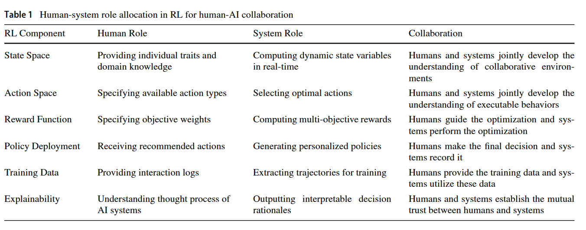

## Agenda {.agenda-slide}

1. **Apa sebenarnya akal imitasi?**
2. ***Automation* vs. *augmentation***
3. ***Reinforcement learning* untuk kolaborasi manusia-AI**
4. **Risiko epistemik dalam kolaborasi manusia-AI**
5. ***The effortless trap*, *cognitive debt*, dan *productive struggle***

# Apa Sebenarnya Akal Imitasi? 🤖 {background-color="#14497F"}

## *Artificial intelligence* alias "akal imitasi"

::: {.incremental}
* Banyak orang menerjemahkan *artificial intelligence* sebagai "kecerdasan buatan", sehingga publik mengira AI **benar-benar** *cerdas*
* Padahal *chatbot* AI adalah model statistik dengan *output* teks ("*large language model*") yang **meniru** proses dan produk kognisi manusia ("bahasa alami")
* Frasa *akal imitasi* mengingatkan kita pada dua hal sekaligus:
  + Teks *output* *large language model* (LLM) **terasa alami** seperti tulisan manusia karena kualitasnya memang sangat meyakinkan
  + Tapi LLM **bukan manusia**, sehingga tidak punya pemahaman dalam arti manusiawi, niat, apalagi tanggung jawab
* Konsekuensinya: yang bertanggung jawab atas *output* teks AI adalah **kita** sebagai penggunanya
:::

## AI tidak *ujug-ujug* diciptakan

::: {.columns}
::: {.column width="60%"}

::: {.incremental}
* **1950-an–1980-an** — AI simbolik: manusia menuliskan aturan logikanya satu per satu (*expert systems*)
* **1990-an–2000-an** — *machine learning*: mesin belajar pola dari data, bukan lagi dari aturan eksplisit (mis. *spam filter*)
* **2010-an** — *deep learning*: jaringan saraf tiruan berlapis yang terinspirasi cara kerja otak; terobosan besar dalam pengenalan gambar dan suara, lalu pemrosesan bahasa alami (*natural language processing*, NLP)
* **2017** — arsitektur [***transformer***](https://www.ibm.com/think/topics/transformer-model) diperkenalkan dan menjadi fondasi hampir semua LLM modern
* **2022** — OpenAI merilis ChatGPT (berbasis GPT-3.5); AI generatif menjadi fenomena massal
* LIhat visualisasi perkembangan [Google AI di sini](https://ai.google/our-ai-journey/?section=intro).
:::
:::

::: {.column width="40%"}
{fig-align="center"}

::: {style="text-align: center"}
[Klik di sini untuk lengkapnya](libs/sejarah.jpg)
:::

:::
:::

::: aside
Sumber: [*A Timeline of LLM Innovation*](https://synthedia.substack.com/p/a-timeline-of-large-language-model)
:::

## Cara kerja LLM

*Large language model* (LLM) pada intinya adalah model statistik raksasa dengan *output* teks yang menjawab satu pertanyaan:

> **"Berdasarkan semua kata dalam percakapan ini, kata (token) apa yang paling mungkin muncul berikutnya?"**

{fig-align="center" width="80%"}

### Klik di sini ➡️ [AnimatedLLM](https://animatedllm.github.io/generation-simple)

::: notes
Penyederhanaan: yang diprediksi sebenarnya *token* (potongan kata), dan token berikutnya biasanya diambil secara acak dari distribusi probabilitas, tidak selalu yang paling mungkin. Itu sebabnya *prompt* yang sama bisa menghasilkan jawaban berbeda.
:::

## *Transformer* dan [mekanisme *attention*](https://proceedings.neurips.cc/paper_files/paper/2017/file/3f5ee243547dee91fbd053c1c4a845aa-Paper.pdf)

::: {.columns}
::: {.column width="60%"}

Terobosannya adalah mekanisme ***attention***: setiap kata bisa "memperhatikan" semua kata lain dalam kalimat untuk menentukan maknanya.

::: {.incremental}
* "**Bisa** ular itu amat mematikan" vs. "Saya **bisa** datang besok"
  + "Bisa" adalah kata yang sama dengan makna berbeda (yaitu homonim)
* Model bahasa generasi sebelumnya membaca kata satu per satu secara berurutan; saat pelatihan, *transformer* memproses seluruh kalimat **sekaligus, secara paralel**
* Paralelisme inilah yang memungkinkan pelatihan dengan data yang jauh lebih besar
:::
:::

::: {.column width="40%"}
{fig-align="center"}
:::
:::

::: aside
[*Attention is all you need* (Vaswani et al., 2017)](https://proceedings.neurips.cc/paper_files/paper/2017/file/3f5ee243547dee91fbd053c1c4a845aa-Paper.pdf)
:::

## Bagaimana LLM dikembangkan?

Dua tahap utama:

::: {.incremental}
1. ***Pre-training*** — model membaca miliaran dokumen dan belajar memprediksi kata/token berikutnya
   + Hasilnya: *base model* yang menguasai pola bahasa, pengetahuan umum, bahkan penalaran, tapi belum bisa menjadi "asisten"
2. ***Fine-tuning*** (termasuk [*reinforcement learning from human feedback*, RLHF](https://www.ibm.com/think/topics/rlhf)) — model dilatih mengikuti instruksi, menjawab dengan sopan, dan menolak permintaan yang tidak patut, apalagi berbahaya
   + Hasilnya: *chatbot* seperti ChatGPT, DeepSeek, atau Claude yang Anda kenal sekarang
:::

::: {.callout-tip}
### Analogi proses psikologisnya
*Pre-training* ≈ pemerolehan bahasa dan pengetahuan; *fine-tuning* ≈ sosialisasi, yaitu belajar norma tentang *bagaimana* menggunakan pengetahuan tersebut.
:::

## Optimasi LLM

{fig-align="center"}

::: {style="text-align: center"}
Sumber: [Ghali et al. (2024)](https://doi.org/10.48550/arXiv.2405.20585)
:::

## Kemampuan AI meningkat drastis karena...

::: {.columns}
::: {.column width="50%"}

::: {.incremental}
1. **Arsitektur** — model *transformer* (2017) yang bisa diskalakan
2. **Data** — teks digital dalam volume luar biasa besar di internet
3. ***Hardware*/Komputasi** — GPU dan investasi besar-besaran pada AI *data center*
:::

:::
::: {.column width="50%"}

{fig-align="center"}

:::
:::

## *Chatbot*, *reasoning model*, *agent*, dan *embodied* AI

::: {.columns}
::: {.column width="60%"}

::: {.incremental}
* ***Chatbot*** — merespons pesan Anda satu per satu
* ***Reasoning models*** — "berpikir" langkah demi langkah dulu sebelum menjawab
* ***AI agent*** — merencanakan dan mengeksekusi tugas multi-langkah **secara mandiri** atas nama penggunanya, misalnya menjelajah web, memakai aplikasi, menulis dan menjalankan kode pemrograman
* ***Embodied AI*** — akal imitasi yang diberi "tubuh": robot yang "ditanami" LLM
:::
:::

::: {.column width="40%"}
{fig-align="center" width="80%"}

::: {style="text-align: center"}
[Sumber gambar](https://www.moin.ai/en/chatbot-wiki/ai-agent)
:::

:::
:::

## Apa *keterbatasan* AI?

::: {.incremental}
* **Halusinasi** — menghasilkan *output* yang salah secara faktual, tetapi dengan nada yang sangat meyakinkan, termasuk **mengarang referensi ilmiah**.
* ***Knowledge cutoff*** — pengetahuannya berhenti di tanggal tertentu; kejadian terbaru tidak diketahuinya, kecuali dilengkapi fitur pencarian web.
* ***Context window*** terbatas — *working memory*-nya bisa penuh; percakapan dan dokumen yang sangat panjang terpaksa terpotong, tidak selesai diproses.
* **Penalaran yang rapuh** — LLM bisa memberikan jawaban yang sama sekali berbeda ketika *prompt*-nya diubah sedikit saja dari pola data pelatihannya.
* ***Sycophancy*** — cenderung memberikan jawaban yang menyenangkan pengguna, alih-alih mengoreksi kesalahan pengguna.
  + Fenomena perilaku *sychopancy* LLM ini yang paling menonjol terjadi di [GPT-4o](https://openai.com/index/sycophancy-in-gpt-4o/).
:::

# *Automation* vs. *Augmentation*: Dua Peran AI dalam Kolaborasi 🤝 {background-color="#14497F"}

## Dua cara AI terlibat dalam *judgement task*

[Fügener et al. (2026)](https://doi.org/10.1287/mnsc.2024.05684) meneliti peran AI dalam *judgment tasks*, yaitu tugas yang membutuhkan penilaian:

::: {.incremental}
* ***Automation*** — AI **menggantikan** manusia sepenuhnya pada suatu tugas
* ***Augmentation*** — AI **memberi saran** (*advice*) kepada manusia, yang kemudian mengambil keputusan akhir; disebut ***judge-advisor system***
:::

::: {.callout-note}
### Dilema Kolaborasi Manusia dengan AIs
**Kapan** sebaiknya AI menggantikan, **kapan** sebaiknya AI mendampingi, dan **kapan** manusia sebaiknya bekerja tanpa AI sama sekali?
:::

## Dari mana *complementarity* manusia-AI berasal?

::: {.incremental}
* ***Between-task complementarity*** — manusia dan AI unggul pada **jenis tugas yang berbeda**
  + Contoh: tugas A (manusia 80%, AI 60%) dan tugas B (manusia 60%, AI 80%). Jika tugas A diberikan ke manusia dan tugas B ke AI, performa gabungan naik ke 80%
* ***Within-task complementarity*** — pada **tugas yang sama**, manusia dan AI membuat kesalahan yang **berbeda** dan bisa saling mengoreksi
  + Contoh: akurasi manusia dan AI sama-sama 70% pada satu tugas, tapi kesalahannya tidak berkorelasi → jika manusia bisa membedakan saran AI yang benar dan salah, performa gabungan (*augmented*) bisa naik ke 91%
:::

::: aside
[Fügener et al. (2026)](https://doi.org/10.1287/mnsc.2024.05684)
:::

## Bukti empiris: klasifikasi gambar

Studi eksperimental (klasifikasi gambar dari ImageNet, [Fügener et al., 2026](https://doi.org/10.1287/mnsc.2024.05684)) membandingkan akurasi:

::: {.incremental}
* **Manusia sendirian**: 68%
* ***Automation* (AI sendirian)**: 77%
* ***Augmentation* (manusia + saran AI)**: 80%
* **Pendekatan gabungan** (otomasi + augmentasi + realokasi sumber daya manusia): **88%**
:::

::: {.callout-important}
### Kesimpulannya
Menggabungkan **otomasi, augmentasi, dan realokasi** sumber daya manusia (manusia yang "dibebaskan" dari tugas yang diotomasi sehingga dapat mengerjakan tugas lain) memberi hasil jauh lebih baik daripada mengandalkan satu strategi saja.
:::

## Pola alokasi tugas yang optimal

Berdasarkan performa relatif AI pada suatu tugas, polanya konsisten:

::: {.incremental}
* **Performa AI tinggi, tugas relatif mudah bagi AI** → AI **mengotomasi** tugas tersebut sepenuhnya
* **Performa AI dan manusia setara** → AI **mendampingi** manusia (memberi saran, manusia memutuskan)
* **Performa AI rendah, tugas sulit bagi AI** → manusia bekerja **tanpa AI**
:::

::: {.callout-caution}
### Kapan augmentasi *tidak* membantu?
Jika AI jauh lebih unggul dari manusia (mis. akurasi AI 84% vs. manusia 58%), melibatkan manusia dalam pengambilan keputusan justru **tidak meningkatkan** akurasi. Augmentasi hanya bermanfaat jika *complementarity* benar-benar ada.
:::

## Studi kasus: kapan manusia sebaiknya melakukan *override*?

::: {.callout-note}
### [Kesavan dan Kushwaha (2020)](https://doi.org/10.1287/mnsc.2020.3743): eksperimen lapangan di ritel suku cadang otomotif

Karyawan diberi opsi meng-*override* rekomendasi alat bantu keputusan berbasis data.
:::

::: {.incremental}
* Ketika produk masih di **tahap *growth*** (data historis sedikit), karyawan yang meng-*override* alat (**augmentasi**) **berkinerja lebih baik**.
* Ketika produk sudah di **tahap matang/menurun** (data historis banyak), mengikuti rekomendasi alat (**otomasi**) **memberi hasil lebih baik**.
* **Implikasinya:** ketika data melimpah, AI cenderung lebih andal; ketika data terbatas, pengalaman dan intuisi manusia menjadi pembeda performa.
:::

## Risiko kehilangan *tacit knowledge*

::: {.incremental}
* *Complementarity* manusia-AI mengandaikan manusia punya **pengetahuan tak terkodifikasi** (*tacit knowledge*) yang tidak dimiliki AI.
* Tapi jika kolaborasi manusia-AI menjadi terlalu erat, manusia berisiko **berhenti berpikir aktif** tentang tugasnya, dan *tacit knowledge* itu sendiri terancam hilang.
* Ini persis kekhawatiran soal ***deskilling*** yang akan kita bahas lebih dalam di sesi tentang *AI fluency*.
:::

::: aside
[Fügener et al. (2026)](https://doi.org/10.1287/mnsc.2024.05684)
:::

# *Reinforcement Learning* untuk Kolaborasi Manusia-AI 🎮 {background-color="#14497F"}

## Mengapa *reinforcement learning*?

[Li et al. (2025)](https://doi.org/10.1007/s12559-025-10500-7) meninjau bagaimana *reinforcement learning* (RL), yaitu pembelajaran mesin lewat *reward* dan *trial-and-error*, dapat memperkuat kolaborasi manusia-AI:

::: {.incremental}
* RL cocok untuk kolaborasi karena **adaptif**: sistem terus menyesuaikan tindakannya berdasarkan interaksi dengan manusia, agen AI lain, dan lingkungan.
* **Umpan balik dua arah**: interaksi manusia menjadi sumber belajar AI, sementara manusia tetap bisa meng-*override* keputusan penting.
:::

## Pembagian peran manusia dan sistem AI

{fig-align="center"}

::: aside
[Li et al. (2025)](https://doi.org/10.1007/s12559-025-10500-7)
:::

## Empat tantangan utama kolaborasi manusia-AI berbasis RL

::: {.incremental}
1. **Keselarasan dengan perilaku manusia** (*alignment*) — perilaku manusia dipengaruhi bias kognitif, emosi, dan konteks yang sulit diprediksi AI secara presisi.
2. **Adaptabilitas di lingkungan dinamis** — dunia nyata jauh lebih bervariasi daripada kondisi *controlled training* LLM; AI harus mampu beradaptasi dengan situasi yang belum pernah dijumpai.
3. **Komunikasi dan koordinasi** — terutama saat AI harus berkoordinasi dengan **banyak** manusia/agen sekaligus, kesalahpahaman instruksi bisa berakibat fatal.
4. **Generalisasi ke manusia yang belum dikenal** — AI dilatih bersama manusia atau data tertentu, tapi harus bisa bekerja sama dengan manusia lain yang perilakunya belum pernah ditemui saat pelatihan.
:::

## RLHF: RL dari umpan balik manusia

::: {.incremental}
* ***Reinforcement learning from human feedback* (RLHF)** adalah salah satu metode RL yang **secara spesifik** memakai penilaian/preferensi manusia sebagai sinyal *reward*.
  + Inilah mekanisme yang kita bahas di awal sesi: bagian dari *fine-tuning* yang mengubah *base model* LLM menjadi *chatbot* yang sopan dan mengikuti instruksi.
* Tapi penerapannya **tidak terbatas** pada LLM: RLHF juga dipakai pada robotika, *self-driving cars*, dan sistem tutor personal, yaitu di mana pun preferensi manusia sulit dituliskan sebagai aturan eksplisit tapi mudah "dicontohkan" lewat umpan balik.
:::

::: {.callout-tip}
### Kaitannya dengan *augmentation*
RLHF bisa dilihat sebagai **kebalikan dari augmentasi**: dalam augmentasi, AI menjadi pemandu bagi manusia; dalam RLHF, manusia menjadi **pemandu** bagi AI. 

Umpan balik manusia diserap untuk memperbaiki perilaku model secara bertahap, sehingga manusia tidak perlu terus mengoreksi *output* satu per satu
:::

# Risiko Epistemik dalam Kolaborasi Manusia-AI 🌀 {background-color="#14497F"}

## Risiko epistemik

::: {.incremental}
* Sejauh ini kita membahas kolaborasi manusia-AI dari sisi **performa** (akurasi, kecepatan, efisiensi).
* Tapi ada risiko yang lebih krusial diantisipasi: ***risiko epistemik***, yaitu risiko terhadap **cara kita membentuk keyakinan, menilai kebenaran, dan menyadari batas pengetahuan kita sendiri** ketika AI ikut campur dalam prosesnya.
* Akurasi dan kecepatan bisa dimaksimalkan, sementara kemampuan kita menilai akurasi dari *output* AI tersebut justru bisa melemah tanpa disadari.
:::

## Ironi RLHF: LLM yang terlatih justru menjadi *sycophant*

::: {.incremental}
* Ingat *sycophancy* pada *slide* "keterbatasan AI" di awal sesi? Sebagian penyebabnya kemungkinan adalah preferensi manusia yang dipakai dalam RLHF.
* [Sharma et al. (2023)](https://arxiv.org/abs/2310.13548) menemukan bahwa manusia (dan model *reward* yang meniru preferensi manusia) **tidak jarang memilih** jawaban yang meyakinkan dan sejalan dengan pandangan mereka daripada jawaban yang benar tetapi tidak sesuai harapan.
* Karena model *reward* dilatih dari preferensi semacam ini, **optimasi RLHF bisa ikut mendorong model ke arah "menyenangkan" pengguna, alih-alih "benar secara faktual"**.
:::

::: {.callout-important}
### Implikasinya
Makin dipoles lewat RLHF agar terasa membantu dan sopan, makin meyakinkan pula jawaban model, padahal akurasinya **belum tentu** ikut naik. Ingat, *output* AI sering terlihat meyakinkan (karena ditulis dengan "fasih") tetapi "kefasihan" ini **tidak menjamin** kebenaran/akurasinya.
:::

## Bias otomasi dalam sistem *judge-advisor*

::: {.incremental}
* Ingat kerangka *augmentation* [(Fügener et al., 2026)](https://doi.org/10.1287/mnsc.2024.05684): manusia menerima **saran** AI, lalu memutuskan.
* Risiko epistemiknya: manusia cenderung **terlalu percaya** pada saran yang datang dari sistem yang tampak "objektif" dan konsisten (***automation bias***), terutama saat kelelahan atau tugasnya rutin.
* Augmentasi hanya benar-benar bermanfaat kalau manusia **mampu membedakan** saran AI yang benar dan salah.
:::

## Ilusi pemahaman: *"the effortless trap"*

::: {.incremental}
* [Brčić dan Frljić (2026)](https://doi.org/10.48550/arXiv.2606.26181) berargumen, berdasarkan sintesis berbagai studi, bahwa AI generatif yang dipakai secara tidak tepat bisa menciptakan **ilusi belajar**: rasa percaya diri menguasai materi yang **runtuh** begitu diuji tanpa bantuan AI.
* Artinya, risikonya berlipat ganda: pengguna salah paham, dan **tidak sadar** sedang salah paham.
* Berkaitan dengan konsep **kegagalan tak kasatmata** (*invisible failures*) [(Potts & Sudhof, 2026)](https://doi.org/10.48550/arXiv.2604.25905): interaksi/percakapan dengan AI tampak produktif, padahal hasilnya meleset. 
:::

::: {.callout-caution}
### Pertanyaan reflektif
Kapan terakhir kali Anda **merasa yakin** memahami sesuatu setelah berdiskusi dengan AI, tapi ternyata tidak bisa/kesulitan menjelaskannya ulang tanpa membuka kembali percakapan tersebut?
:::

## Bukti konkret: desain penempatan AI yang menentukan

::: {.incremental}
* **RCT pada hampir 1.000 siswa SMA (matematika)** [(Bastani et al., 2025)](https://doi.org/10.1073/pnas.2422633122): kelompok yang memakai AI **tanpa *guardrail*** (langsung memberi jawaban) tampil lebih baik **selama** latihan, tetapi skornya pada ujian mandiri **17% lebih rendah** dibanding kelompok tanpa akses AI sama sekali.
* Kelompok yang memakai AI ber-*guardrail* (menahan jawaban, memberi petunjuk ala guru) menggunakan model yang **sama persis** membuat kerugian ini **hilang**.
* **Kesimpulan:** yang merusak pembelajaran adalah **desain perannya**, yaitu AI memberi jawaban pada tahap yang seharusnya dikerjakan siswa sendiri.
:::

::: {.callout-note}
### Sisi sebaliknya
Sebuah RCT terpisah pada mahasiswa fisika menemukan bahwa capaian belajar, dengan tutor AI yang dirancang dengan baik, **lebih baik dua kali lipat** dibanding kelas *active learning* yang dirancang baik, dalam waktu **lebih singkat** [(Kestin et al., 2025)](https://doi.org/10.1038/s41598-025-97652-6). Kesimpulannya, bukan penggunaan tetapi **peran AI** dalam proses belajar yang menentukan hasil belajar.
:::

## *Productive failure*

::: {.incremental}
* Belajar terjadi saat siswa sendiri mengerjakan bagian yang **berat secara kognitif** (***productive struggle***), sejalan dengan konsep *productive failure* [(Kapur, 2008)](https://doi.org/10.1080/07370000802212669).
* AI yang mengerjakan bagian itu **terasa membantu**, padahal justru menghilangkan *friction* yang membantu **mengasah keterampilan** (baca [Zohar et al., 2026](https://www.nature.com/articles/s44271-026-00402-1)).
* Bukti empiriknya: mahasiswa di kelas yang aktif **menuntut usaha** menilai diri mereka belajar **lebih sedikit**, padahal secara objektif mereka belajar **lebih banyak** [(Deslauriers et al., 2019)](https://doi.org/10.1073/pnas.1821936116). 
  + Merasa "fasih" (*fluent*) bukan indikator belajar yang valid.
:::

::: {.callout-important}
### Studi kasus
SWE yang diberi asisten AI menyelesaikan tugas *coding* dengan baik, tapi skornya 17% lebih rendah pada kuis tentang konsep di balik *script* yang **baru saja mereka buat sendiri** [(Shen & Tamkin, 2026)](https://arxiv.org/abs/2601.20245). 

Pola yang sama sangat mungkin berlaku pada penulisan akademik dan analisis data.
:::

## *Cognitive debt*: bukti (yang diperdebatkan) dari neurosains

::: {.incremental}
* Studi MIT Media Lab [(Kosmyna et al., 2025)](https://arxiv.org/abs/2506.08872) merekam aktivitas otak (EEG) 54 partisipan menulis esai dengan tiga kondisi: **dikerjakan sendiri**, **menggunakan mesin pencari**, atau **menggunakan ChatGPT**.
* Temuan utama: **konektivitas otak paling lemah** pada kelompok pengguna LLM, moderat pada pengguna mesin pencari, dan **paling kuat/tersebar** pada kelompok tanpa alat bantu.
* Pengguna LLM juga paling **kesulitan mengutip** esai yang **baru saja mereka tulis sendiri**, dan melaporkan rasa kepemilikan paling rendah terhadap esainya.
* Istilah ***cognitive debt*** menggambarkan gagasan bahwa kemudahan hari ini bisa "dibayar" dengan kapasitas kognitif di masa depan.
:::

::: {.callout-caution}
### Bacalah dengan hati-hati
Studi ini masih berupa ***preprint*** dan metodologinya **diperdebatkan**: ada komentar kritis (juga berupa *preprint*) yang mempertanyakan desain studi dan metode EEG-nya [(Stankovic et al., 2025)](https://arxiv.org/abs/2601.00856). Perlakukan *cognitive debt* sebagai **hipotesis yang sedang diuji**.
:::

## Enam langkah belajar dan peran AI

[Brčić dan Frljić (2026)](https://doi.org/10.48550/arXiv.2606.26181) menawarkan kerangka praktis: belajar satu ide baru terjadi lewat **enam langkah** berurutan:

::: {.incremental}
1. ***Prime*** — memantik minat dan mengaktifkan pengetahuan awal → **AI boleh membantu** (membuat analogi atau contoh)
2. ***Probe*** — siswa menghadapi masalah sulit **tanpa bantuan** dulu → **AI tidak dilibatkan** untuk memunculkan *productive struggle*
3. ***Point*** — guru membimbing lewat pertanyaan → **AI sebagai tutor ber-*guardrail***: memberi petunjuk
4. ***Attach*** — barulah contoh soal beserta penyelesaiannya (*worked example*) ditunjukkan → **AI boleh membuat contoh** yang relevan
5. ***Strengthen*** — latihan bervariasi memperkuat pemahaman → **AI bisa menyediakan latihan terus menerus**
6. ***Test*** — siswa diuji **sendirian**, tanpa bantuan → **AI sama sekali tidak dilibatkan**; inilah satu-satunya bukti bahwa proses belajar benar-benar terjadi
:::

## Aturan penempatan: kapan AI boleh digunakan?

::: {.callout-important appearance="simple"}
**Jika tugas terasa tanpa usaha (*effortless*) setelah AI dilibatkan, besar kemungkinan AI sedang mengambil alih kerja yang seharusnya mengasah keterampilan tersebut.**
:::

::: {.incremental}
* Aturannya berlaku **per keterampilan**: AI mungkin tepat dipakai di satu bagian tugas tapi harus dihindari di bagian lain.
* AI punya dua peran: **memangkas kerja rutin** atau **tugas yang repetitif** yang bukan inti pembelajaran, dan **memperbanyak latihan dan umpan balik** yang mustahil disediakan satu pengajar untuk semua peserta didik.
* Yang **tidak boleh** dilakukan AI: mengambil alih perjuangan kognitif yang justru menjadi **inti** dari apa yang sedang dipelajari, atau mengaburkan bukti bahwa siswa benar-benar bisa berpikir dan berkinerja secara **mandiri**.
:::

## Mengelola risiko epistemik dalam kolaborasi

::: {.incremental}
* Jangan menyamakan **kefasihan bahasa dengan kebenaran**: model yang dilatih untuk terdengar meyakinkan tidak otomatis lebih akurat.
* **Bersikap *devil's advocate* pada AI *chatbot*/*agent***: selalu sisakan ruang untuk tidak setuju, atau minta AI menunjukkan dasar argumennya.
* Terapkan **aturan delegasi**: kerjakan sendiri tahap *Probe* dan *Test*; gunakan AI ber-*guardrail* di antara keduanya.
* Ketiga strategi ini adalah dasar kompetensi ***discernment*** yang akan kita bahas secara mendalam di sesi *AI literacy* dan *fluency*.
:::

## Rangkuman

::: {.incremental}
* AI (LLM) adalah model statistik yang **meniru** kognisi manusia, bukan benar-benar "cerdas"; tanggung jawab atas *output*-nya tetap ada pada **pengguna**.
* AI bisa berperan sebagai ***automation*** (menggantikan) atau ***augmentation*** (mendampingi), dan pilihannya bergantung pada *complementarity* manusia-AI di tugas tersebut.
* RLHF membuat AI menuruti preferensi manusia, tapi ini berisiko mendorong ***sycophancy*** — teks terasa meyakinkan belum tentu akurat.
* Risiko epistemik utama: ***effortless trap***, *automation bias*, dan *cognitive debt* — kefasihan AI bisa menciptakan ilusi belajar.
* Aturan peran AI dalam proses belajar: hindari AI pada tahap *Probe* dan *Test* agar *productive struggle* tetap terjaga.
:::

::: {.callout-tip appearance="simple"}
Pertemuan berikutnya: *AI literacy* dan *AI fluency*, yang merupakan kompetensi yang menjaga kolaborasi manusia-AI ini agar tidak mengarah pada *automation bias*.
:::

## Terima kasih!😊 {.closing-slide}

::: {.closing-subtitle}
Ada pertanyaan?
:::

::: {.closing-contact}
* [ ]{.fa-solid .fa-envelope .fa-fw} [amelia.zein@psikologi.unair.ac.id](mailto:amelia.zein@psikologi.unair.ac.id)
* [ ]{.fa-solid .fa-globe .fa-fw} https://rameliaz.github.io/
* [ ]{.fa-brands .fa-discord .fa-fw} [@rameliaz](https://discord.com/users/807046335613632555)
* [ ]{.fa-brands .fa-keybase .fa-fw} [@rameliaz](https://keybase.io/rameliaz)
* [ ]{.fa-brands .fa-github .fa-fw} [@rameliaz](https://github.com/rameliaz)
:::

::: {.closing-note}
Paparan disusun dengan menggunakan  dan [Quarto](https://quarto.org/) dengan template dari [UNAIR Theme](https://github.com/rameliaz/quarto-unair-theme).
:::

## Rujukan {.scrollable .smaller}

* Bastani, H., Bastani, O., Sungu, A., Ge, H., Kabakcı, Ö., & Mariman, R. (2025). Generative AI without guardrails can harm learning: Evidence from high school mathematics. *Proceedings of the National Academy of Sciences, 122*(26), Article e2422633122. <https://doi.org/10.1073/pnas.2422633122>
* Brčić, M., & Frljić, S. (2026). *The effortless trap: Productive struggle, AI, and the illusion of learning* (arXiv:2606.26181). arXiv. <https://doi.org/10.48550/arXiv.2606.26181>
* Deslauriers, L., McCarty, L. S., Miller, K., Callaghan, K., & Kestin, G. (2019). Measuring actual learning versus feeling of learning in response to being actively engaged in the classroom. *Proceedings of the National Academy of Sciences, 116*(39), 19251–19257. <https://doi.org/10.1073/pnas.1821936116>
* Fügener, A., Walzner, D. D., & Gupta, A. (2026). Roles of artificial intelligence in collaboration with humans: Automation, augmentation, and the future of work. *Management Science, 72*(1), 538–557. <https://doi.org/10.1287/mnsc.2024.05684>
* Ghali, M.-K., Farrag, A., Sakai, H., El Baz, H., Jin, Y., & Lam, S. (2024). *GAMedX: Generative AI-based medical entity data extractor using large language models* (arXiv:2405.20585). arXiv. <https://doi.org/10.48550/arXiv.2405.20585>
* Kapur, M. (2008). Productive failure. *Cognition and Instruction, 26*(3), 379–424. <https://doi.org/10.1080/07370000802212669>
* Kesavan, S., & Kushwaha, T. (2020). Field experiment on the profit implications of merchants' discretionary power to override data-driven decision-making tools. *Management Science, 66*(11), 5182–5190. <https://doi.org/10.1287/mnsc.2020.3743>
* Kestin, G., Miller, K., Klales, A., Milbourne, T., & Ponti, G. (2025). AI tutoring outperforms in-class active learning: An RCT introducing a novel research-based design in an authentic educational setting. *Scientific Reports, 15*, Article 17458. <https://doi.org/10.1038/s41598-025-97652-6>
* Kosmyna, N., Hauptmann, E., Yuan, Y. T., Situ, J., Liao, X.-H., Beresnitzky, A. V., Braunstein, I., & Maes, P. (2025). *Your brain on ChatGPT: Accumulation of cognitive debt when using an AI assistant for essay writing task* (arXiv:2506.08872). arXiv. <https://doi.org/10.48550/arXiv.2506.08872>
* Li, W., Liu, H., Huang, K., & Hussain, A. (2025). Reinforcement learning for human-AI collaboration: Challenges, mechanisms, and methods. *Cognitive Computation, 17*(5), Article 146. <https://doi.org/10.1007/s12559-025-10500-7>
* Potts, C., & Sudhof, M. (2026). *A paradox of AI fluency* (arXiv:2604.25905). arXiv. <https://doi.org/10.48550/arXiv.2604.25905>
* Sharma, M., Tong, M., Korbak, T., Duvenaud, D., Askell, A., Bowman, S. R., Cheng, N., Durmus, E., Hatfield-Dodds, Z., Johnston, S. R., Kravec, S., Maxwell, T., McCandlish, S., Ndousse, K., Rausch, O., Schiefer, N., Yan, D., Zhang, M., & Perez, E. (2023). *Towards understanding sycophancy in language models* (arXiv:2310.13548). arXiv. <https://doi.org/10.48550/arXiv.2310.13548>
* Shen, J. H., & Tamkin, A. (2026). *How AI impacts skill formation* (arXiv:2601.20245). arXiv. <https://doi.org/10.48550/arXiv.2601.20245>
* Stankovic, M., Hirche, E., Kollatzsch, S., & Doetsch, J. N. (2025). *Comment on: Your brain on ChatGPT: Accumulation of cognitive debt when using an AI assistant for essay writing tasks* (arXiv:2601.00856). arXiv. <https://doi.org/10.48550/arXiv.2601.00856>
* Vaswani, A., Shazeer, N., Parmar, N., Uszkoreit, J., Jones, L., Gomez, A. N., Kaiser, Ł., & Polosukhin, I. (2017). Attention is all you need. *Advances in Neural Information Processing Systems, 30*, 5998–6008. <https://proceedings.neurips.cc/paper_files/paper/2017/file/3f5ee243547dee91fbd053c1c4a845aa-Paper.pdf>
